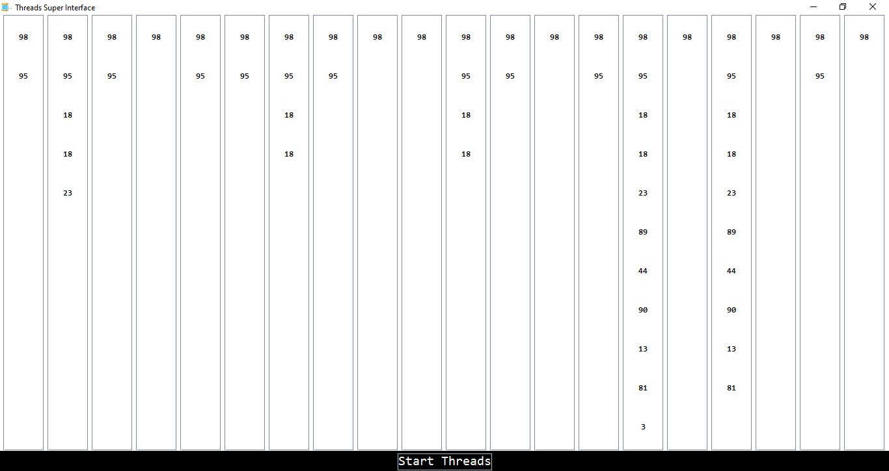

# GUI-Threads 🧵🕰🧵

Shows in graphic user interface how the java threads work, displays a list of numbers in multiple columns at different speed each one, works with simple list data structure

Used I.D.E - Eclipse \
Design pattern - M.V.C.

